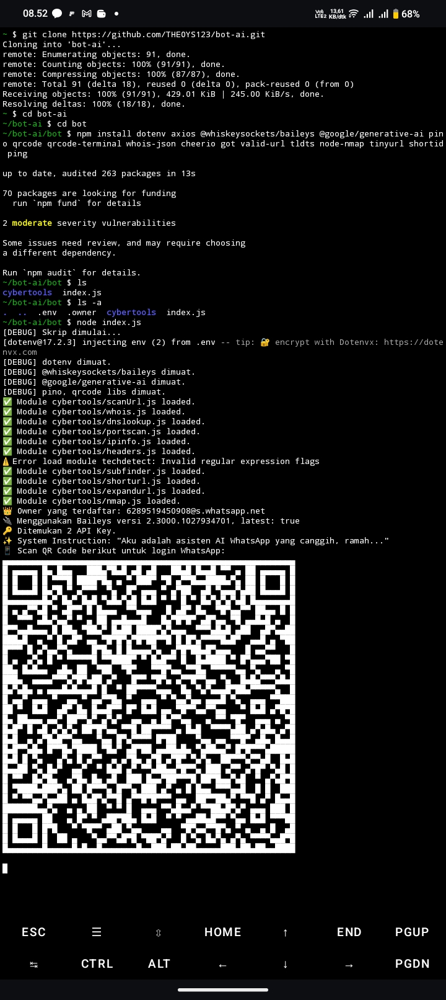

no deskripsi!
cara penggunaan baca di bawah yee 👇
---

# install awalan

```
git clone https://github.com/THEOYS123/bot-ai.git
cd bot-ai
cd bot
ls
```
---
# install requirements/module

```
npm install dotenv axios @whiskeysockets/baileys @google/generative-ai pino qrcode qrcode-terminal whois-json cheerio got valid-url tldts node-nmap tinyurl shortid ping
```
--- 
# tahap akhir
```
ls -a
node index.js
```
# screenshoot 📸
 
